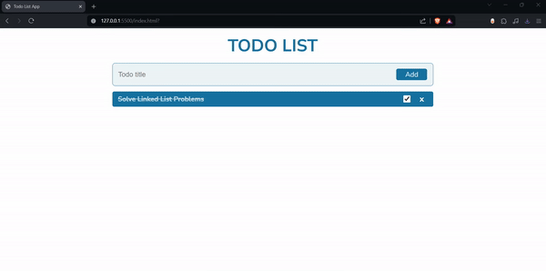

# TO-DO-LIST

This is a simple Todo List application built using HTML, CSS, and JavaScript. It allows users to add, remove, and mark tasks as completed.

## Demo



## Run Locally

Clone the project

```bash
  git clone https://github.com/DheerajKandoor/TO-Do-List
```

Open index.html in your web browser.

Start adding tasks to your Todo List!
